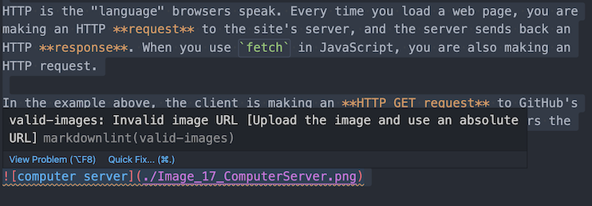

# Markdown Lint Rules for Flatiron Lessons

Custom linting rules for [`markdownlint`][markdownlint] for the Flatiron
Software Engineering curriculum.

## Custom Rules

| Name                 | Description                                                                                            |
| -------------------- | ------------------------------------------------------------------------------------------------------ |
| `has-learning-goals` | Checks if a lesson has a `## Learning Goals` heading                                                   |
| `inclusive-language` | Checks words in the lesson using a dictionary based on the [Inclusive Language Style Guide][inclusive] |
| `valid-images`       | Checks if images in a lesson use an absolute URL (beginning with `http` or `https`)                    |

[markdownlint]: https://github.com/DavidAnson/markdownlint
[inclusive]: https://docs.google.com/document/d/1QK__2vmuLcAnlat8OIVlZ4T0TDsoqpuayPjij2ID1fY/edit
[extension]: https://marketplace.visualstudio.com/items?itemName=DavidAnson.vscode-markdownlint
[markdownlint-cli]: https://github.com/igorshubovych/markdownlint-cli

## Usage

All of Flatiron's lessons use Markdown as the format for written content. To
ensure our content is formatted consistently, we use
[`markdownlint`][markdownlint] to report any issues and enforce standards and
consistency. There are a number of ways to use [`markdownlint`][markdownlint]:

### VSCode Integration

Assuming you have the [`markdownlint` VSCode extension][extension] installed:

1. Clone this repository, and make a note of its directory:

   ```console
   $ git clone git@github.com:learn-co-curriculum/markdownlint-rules-flatiron-lesson
   $ echo "$PWD/markdownlint-rules-flatiron-lesson"
   /Users/ianhollander/dev/curriculum/markdownlint-rules-flatiron-lesson
   ```

2. Open the Command Palette in VSCode (`Command+Shift+P`), and type
   `Preferences: Open Settings (JSON)`

3. Add a `markdownlint.customRules` property to configuration JSON file, and add
   the repo directory:

   ```json
   {
     "markdownlint.customRules": [
       "/Users/ianhollander/dev/curriculum/markdownlint-rules-flatiron-lesson"
     ]
   }
   ```

The `markdownlint` extension should now highlight any formatting issues based on
this configuration:



To disable specific rules, add a `markdownlint.config` section in the your
VSCode configuration file, and use the rule names specified below to configure
specific rules:

```json
{
  "markdownlint.config": {
    "has-learning-goals": false
  }
}
```

### Manual Checks

1. Install [markdownlint-cli][]:

   ```console
   $ npm install -g markdownlint-cli
   ```

2. Clone this repository, and make a note of its directory:

   ```console
   $ git clone git@github.com:learn-co-curriculum/markdownlint-rules-flatiron-lesson
   $ echo "$PWD/markdownlint-rules-flatiron-lesson"
   /Users/ianhollander/dev/curriculum/markdownlint-rules-flatiron-lesson
   ```

3. Run the CLI to see a list of issues:

   ```console
   $ markdownlint -r /Users/ianhollander/dev/curriculum/markdownlint-rules-flatiron-lesson/rules/index.js ./README.md

   ./README.md:2 has-learning-goals Missing ## Learning Goals heading [Add a ## Learning Goals section]
   ```

## Contributing

Have an idea for a new custom rule? Want to improve our inclusive language
dictionary? Great! Check out the [CONTRIBUTING.md](./CONTRIBUTING.md) page to
get started.
